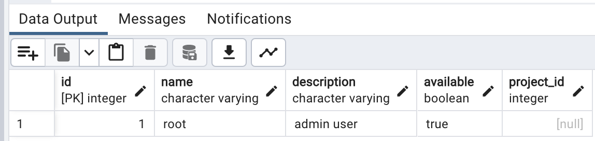

# zygarde-spring-boot-v3

+ [zygarde version](https://github.com/zygarde-projects/zygarde/tree/v3) - v3.0.2
+ spring boot version - v3.0.4

> **Warning**
> :zygard v3 hasn't been pushed to public repository. You can create your own repository and push `v3` branch of zygarde to it.
> Then you have to add source to `repositories` in the `build.gradle.kts`.

A Kotlin example to get data from Postgresql

## Before use

step 1. set your database config in application.properties, make sure you've already connected with database.

step 2. create a `roles` table under `public` schema, and columns of `roles` as described below:

step 3. generated Dao with command `./gradlew kaptKotlin`

step 4. run command `./gradlew bootRun`

step 5. got to http://localhost:8080/data, then you will see the data from `roles` table.

